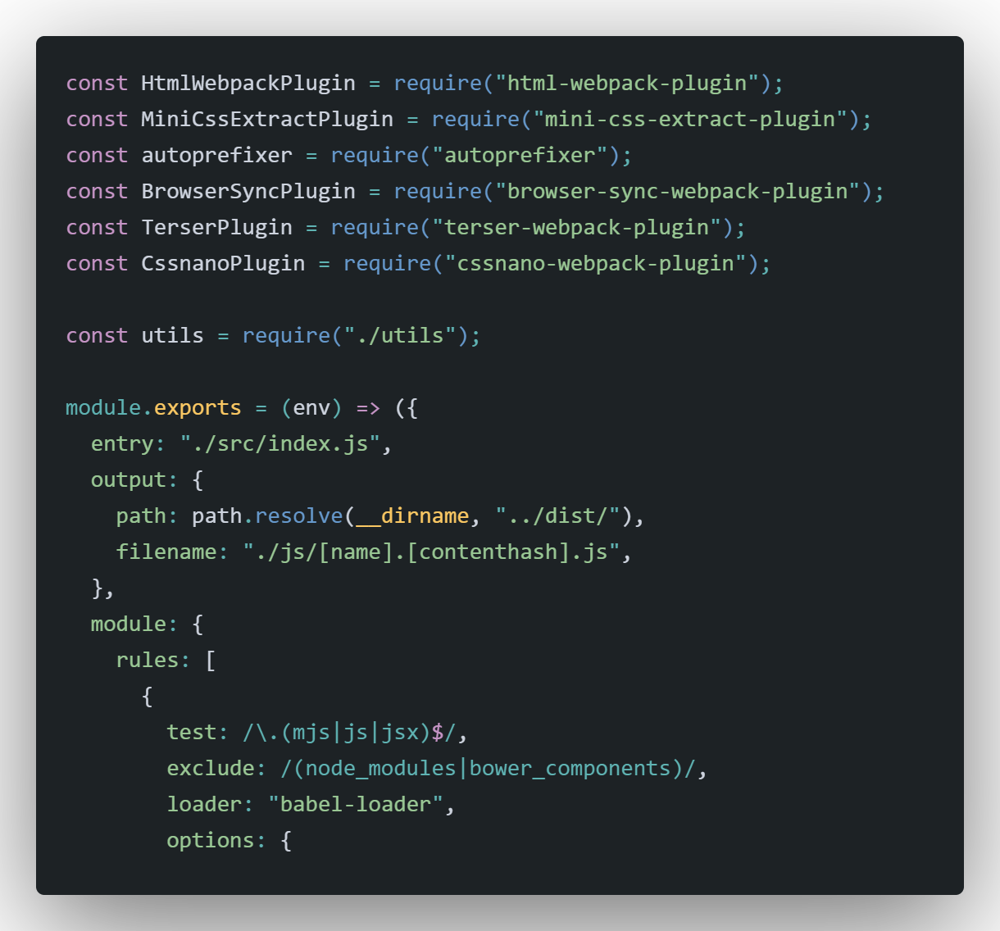

# Workflow Webpack: Babel, Sass, Pug, Images, Files & Browser-Sync



## Start Proyect: 🔧
- Developer: 
```bash
    ``npm run start`` ó ``yarn start``
```

- Production: 
```bash
    ``npm run build`` ó ``yarn build``
```

## Build with 🛠️
Workflow Webpack: Babel, Sass, Pug, Images, Files & Browser-Sync
* [Webpack](https://webpack.js.org/)
* [Babel](https://babeljs.io/)
* [Sass](https://sass-lang.com/) 
* [Pug](https://pugjs.org/api/getting-started.html) 
* [browserSync](https://www.browsersync.io) 

## Help 
```
Sass: 
    Ej: background-image: url("../images/img.svg");
```

### License 📄
[MIT](https://choosealicense.com/licenses/mit/)